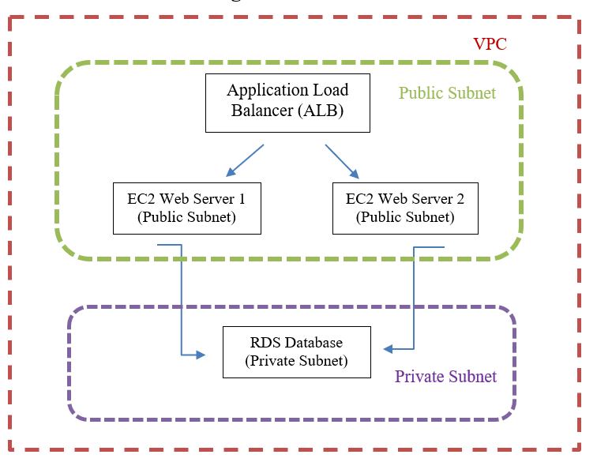

# AWS Cloud Architecture Project

## Overview
This project demonstrates the deployment of a scalable cloud architecture on AWS using EC2, Application Load Balancer, monitoring, and Infrastructure as Code.

---

## Architecture Diagram

---

## Deployment Files

-  Project Report: `Project Two-asma.pdf`
-  CloudFormation Template: `template.yaml`
-  Architecture Diagram: `Diagram.png`

---

## Architecture Description
The architecture is deployed within a Virtual Private Cloud (VPC) consisting of public and private subnets. The public subnets host the Application Load Balancer and EC2 web servers, while the private subnet is designed to host the RDS database securely.

---

## Features
- High Availability using Load Balancer
- Monitoring with CloudWatch
- Infrastructure as Code using CloudFormation
- Secure network design using VPC and subnets

---

## Notes
Due to AWS permission limitations, the RDS database was planned but not fully implemented.

---

## Conclusion
This project demonstrates a functional and scalable AWS cloud architecture following best practices.
